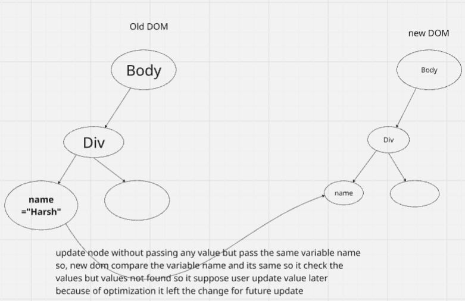

<h1>💥 What are props?</h1>
Props(short for properties) are inputs you pass from a parent component to a child component in React.
They let you send data,values or functions into components so they can behave dynamically.

<h5>why do we use props</h5>
<ul>
    <li>To customize a component's behavior.</li>
    <li>To reuse components with different data.</li>
    <li>To communicate between parent -> child components</li>
</ul>

<h5>Important Points</h5>
<ul>
    <li>Props are read-only inside the child.</li>
    <li>You can pass any type: sting, number, array, object, function.</li>
    <li>props allow component reuse with different content</li>
</ul>

cleaifing the image contex ->
✅ If you initialize a variable without assigning a value, and your app or DOM still has old values from a previous render or cached build, the old values may continue showing in the UI until the new value is explicitly set or the app is fully rebuilt.

But important details:

    React does not automatically carry old values from the DOM into new variables.
    Instead:
    → React re-renders based on state, props, and code.
    → If you didn’t clear or rebuild your code, old values might stay visible because the old JavaScript bundle is still running.

    The DOM itself doesn’t keep variable values. It only reflects what React (or JavaScript) tells it to render.

    A cached bundler (like Parcel, Vite) or stale React state is usually the real reason why you see old values, not the DOM holding variables.